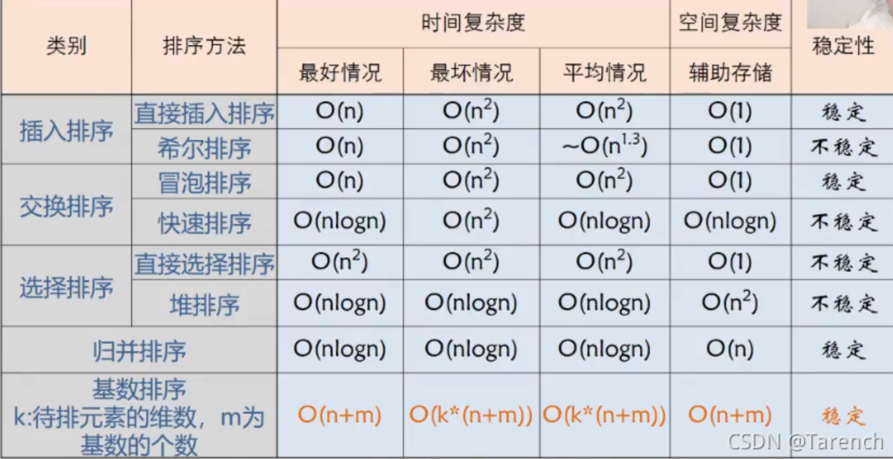

## 基数排序

假设长度为 n 的线性表中每个结点$a_j$的关键字由 d 元组（$ k_j^{d−1},k_j^{d−2},...,k_j^1,k_j^0$）组成。其中，$0\le k_j^i\le r−1(0\le j\le n,0\le i\le d−1)$，r 称为`基数`。

比如三位整数，基数为 0-9，d 为 3。可以把基数理解为取值范围，d 理解为维度。

基数排序得到递增序列的过程如下：

- 初始化：设置 r 个空队列，$Q_{0},Q_{1},...,Q_{r-1}$
- 按照各个关键字位权重递增的次序（例如数字的 个、十、百），对 d 个关键字位分别做“分配”和“收集”
- 分配：顺序扫描各个元素，若当前处理的关键字位=x，则将元素插入 $Q_x$ 队尾
- 收集：把 $Q_{0},Q_{1},...,Q_{r-1}$ 各个队列中的结点依次出队并链接

### 算法效率分析
基数排序通常基于链式存储实现。

1.空间复杂度

需要 r 个辅助队列，空间复杂度 O(r) 

2.时间复杂度：

把关键字拆为d dd个部分，每个部分可能取得r rr个值

一趟分配 O(n)，一趟收集 O(r) ，总共 d 趟分配、收集，总的时间复杂度=$O(d(n+r))$

3.稳定性：稳定的

### 擅长解决的问题

1. 数据元素的关键字可以方便的拆分成 d 组，且 d 较小
1. 每组关键字的取值范围不大，即 r 较小
1. 数据元素个数 n 较大

## 基础排序算法比较

